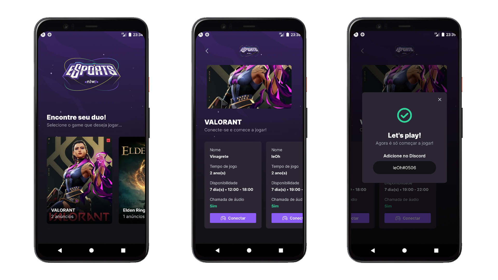

<h1 align="left"> 🎮 Find Your Duo - Mobile</h1>

O Find Your Duo é um projeto que foi desenvolvido durante a semana do evento NLW eSports disponibilizado pela <a href="https://www.rocketseat.com.br/">Rocketseat</a>.

Esse projeto possui o objetivo de ajudar os players a encontrarem um parceiro ou uma parceira para jogarem juntos os seus jogos favoritos. 

Na versão mobile do Find Your Duo, será onde o player poderá se conectar a outros players para jogarem juntos. Inicialmente temos uma tela onde serão listados todos os jogos disponíveis na plataforma, e, ao clicar em algum jogo em específico, serão listados todos os anúncios que foram publicados para esse jogo através da <a href="https://github.com/leOhsantos/FindYourDuoWeb">versão web</a> do Find Your Duo. Ao clicar em "Conectar" no anúncio de algum player, será mostrado na tela o Discord desse player através de um modal. E após isso é só procurar por esse player no Discord e ir para a gameplay!

 

## 🚀 Tecnologias utilizadas

 
 
 

 

## 📷 Design do projeto

